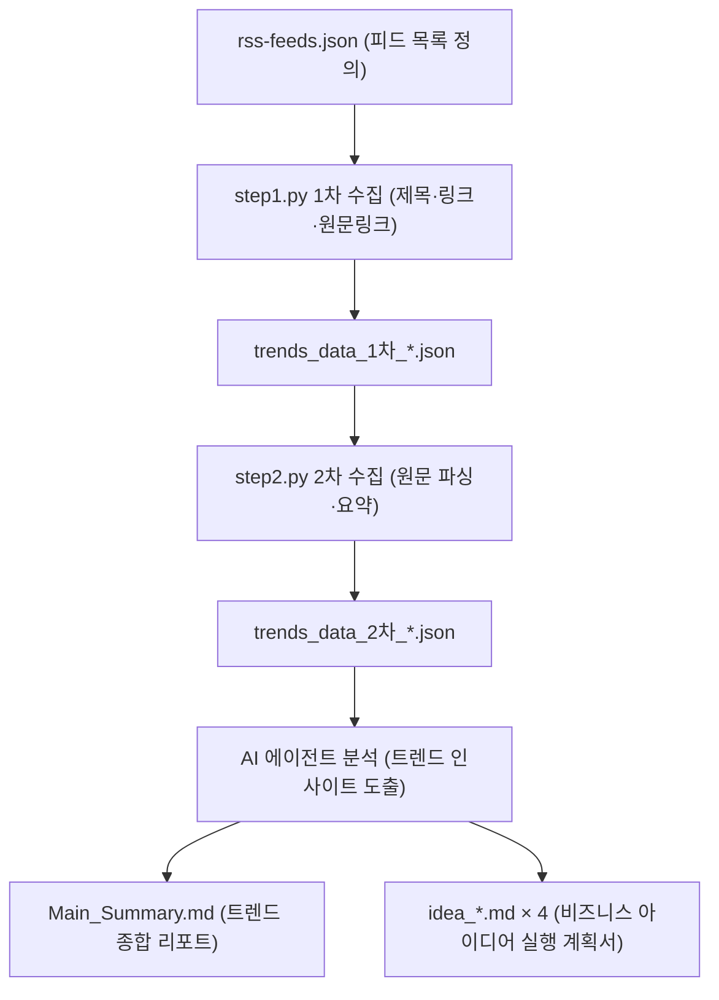

# 📡 RSS Trend Idea Workflow

> 트렌드·경제·과학·테크·블로그 등 다양한 RSS 피드에서 최신 컨텐츠를 자동 수집하고,  
> 핵심 요점을 정리한 뒤, 사업화 가능한 비즈니스 아이디어를 도출하는 자동화 레포지토리입니다.

---

## 📌 개요

이 레포지토리는 **`rss-trend-idea-workflow`** 스킬을 활용하여 다음의 3단계 파이프라인을 자동으로 수행합니다.

```
[Step 1] RSS 피드 수집 → [Step 2] 원문 요약 추출 → [Step 3] AI 분석 + 아이디어 마크다운 생성
```

- **Google 트렌드 / 뉴스** (경제·과학·AI), **GeekNews**, **TechCrunch AI**, **ByteByteGo**, **The Verge**, **OpenAI Blog**, **a16z Blog**, **Stratechery** 등 다양한 피드 소스를 지원합니다.
- 수집된 트렌드 데이터를 AI가 분석하여 **Software / Data & AI / IT Services / YouTube & Media** 4개 카테고리로 구분된 비즈니스 아이디어를 제안합니다.
- 각 아이디어는 **실현 가능성 점수(1~5점)** 및 **근거 RSS 피드 링크**와 함께 상세 실행 계획서로 저장됩니다.

---

## 🗂️ 디렉토리 구조

```
06_ideas-docs/
├── .agent/
│   └── skills/
│       └── rss-trend-idea-workflow/    # 스킬 정의 및 실행 스크립트
│           ├── SKILL.md                # 스킬 메인 가이드
│           ├── GUIDE_v1.md             # 사용 가이드 (v1)
│           ├── step1.py                # 1차 RSS 피드 수집 스크립트
│           └── step2.py                # 2차 원문 요약 스크립트
│
├── 01_prompts/                         # 프롬프트 템플릿 모음
├── 02_skills/                          # 분석 스킬 정의 문서
├── 03_rss-feeds/                       # 공통 RSS 피드 설정
│
├── 10_idea-google-search/              # 📂 Google 뉴스 기반 아이디어 (기본 폴더)
│   ├── rss-feeds.json                  # Google 트렌드·전체·경제·과학·AI 뉴스
│   ├── step1.py / step2.py             # (스킬 스크립트 사본)
│   └── *.md                            # 생성된 트렌드 분석 및 아이디어 리포트
│
├── 11_idea-geeknews/                   # 📂 GeekNews + TechCrunch AI 기반 아이디어
│   ├── rss-feeds.json
│   └── *.md
│
├── 12_idea-bytebytego/                 # 📂 ByteByteGo + The Verge 기반 아이디어
│   ├── rss-feeds.json
│   └── *.md
│
├── 13_idea-ai-models/                  # 📂 OpenAI Blog 기반 AI 모델 아이디어
│   ├── rss-feeds.json
│   └── *.md
│
└── 14_idea_bonus-feed/                 # 📂 The Rundown AI · Stratechery · a16z 등 보너스 피드
    ├── rss-feeds.json
    └── *.md
```

---

## 📡 RSS 피드 소스

각 폴더는 `rss-feeds.json` 파일로 수집할 피드 소스를 정의합니다.

| 폴더 | 피드 소스 | 특징 |
|---|---|---|
| `10_idea-google-search` | Google 트렌드, Google 전체·경제·과학·AI 뉴스 | 한국 실시간 트렌드 + 구글 뉴스 |
| `11_idea-geeknews` | GeekNews, TechCrunch AI | 국내외 개발자·테크 커뮤니티 |
| `12_idea-bytebytego` | ByteByteGo Blog, The Verge | 시스템 설계 + 테크 미디어 |
| `13_idea-ai-models` | OpenAI Blog | AI 모델 최신 연구 및 발표 |
| `14_idea_bonus-feed` | The Rundown AI, Stratechery, a16z Blog, Simon Willison's Blog | 전략·VC·AI 인사이트 뉴스레터 |

---

## 🚀 사용 방법

### 사전 요건

Python 환경 및 다음 패키지가 설치되어 있어야 합니다.

```bash
pip install feedparser requests beautifulsoup4 duckduckgo-search googlenewsdecoder lxml
```

> ⚠️ **Windows PowerShell 환경**: `UnicodeEncodeError` 방지를 위해 Python 실행 시 반드시 `$env:PYTHONIOENCODING="utf-8"` 를 prefix로 추가해야 합니다.

---

### AI 에이전트를 통한 실행 (권장)

Antigravity IDE (또는 호환 AI 에이전트)에서 슬래시 커맨드로 전체 파이프라인을 자동 실행합니다.

```
/rss-trend-idea-workflow -f [폴더명]
```

**예시:**
```
/rss-trend-idea-workflow -f 10_idea-google-search
/rss-trend-idea-workflow -f 11_idea-geeknews
/rss-trend-idea-workflow -f 12_idea-bytebytego
```

기본값은 `10_idea-google-search` 폴더입니다.

---

### 수동 실행 (단계별)

#### Step 1 — RSS 피드 1차 수집

지정 폴더의 `rss-feeds.json`을 읽어 각 피드의 최신 3개 기사 제목·링크를 수집합니다.

```powershell
$env:PYTHONIOENCODING="utf-8"; python [폴더명]\step1.py -f [폴더명]
```

- **출력**: `[폴더명]/trends_data_1차_YYYY-MM-DD_HHMMSS.json`

#### Step 2 — 원문 2차 요약 수집

1차 수집 결과의 URL을 순회하여 실제 기사 본문을 파싱하고 120자 이상의 핵심 요약을 추출합니다.

```powershell
$env:PYTHONIOENCODING="utf-8"; python [폴더명]\step2.py -f [폴더명]
```

- **출력**: `[폴더명]/trends_data_2차_YYYY-MM-DD_HHMMSS.json`

#### Step 3 — AI 분석 및 마크다운 리포트 생성

2차 JSON 데이터를 AI가 분석하여 **총 5개의 마크다운 파일**을 생성합니다.

| 파일 | 내용 |
|---|---|
| `YYYY-MM-DD_HHMMSS_idea_Main_Summary.md` | 트렌드 종합 분석 리포트 (메인) |
| `YYYY-MM-DD_HHMMSS_idea_[아이디어명].md` × 4 | 각 카테고리별 비즈니스 아이디어 상세 실행 계획서 |

---

## 💡 아이디어 도출 기준

AI 에이전트는 수집된 요약 데이터를 바탕으로 아래 4개 카테고리에 각 1개씩, 총 4개의 사업 아이디어를 제안합니다.

| 카테고리 | 세부 분야 |
|---|---|
| **Software** | B2B SaaS, DevTools, Cybersecurity |
| **Data & AI** | LLM Apps, DataOps, Vertical AI, MLOps |
| **IT Services** | Marketplace, Digital Healthcare, Fintech/Insurtech, EdTech |
| **YouTube & Media** | AI Automation, Virtual Human/IP, Interactive, Analytics |

각 아이디어에는 다음이 포함됩니다.

- ✅ **실현 가능성 점수** (1~5점 + 근거)
- 🔗 **근거 RSS 피드** 제목, 링크, 요약
- 📋 **상세 실행 계획** (타겟 고객, 수익 모델, MVP 전략 등)

---

## ⚙️ 동작 원리



**핵심 기술 포인트:**
- Google News URL의 경우 `googlenewsdecoder` + HTTP 리다이렉트 추적 + DuckDuckGo 검색으로 원문 URL을 복원합니다.
- `step2.py`는 기사 본문 추출 시 `<article>` 태그 우선 파싱, 메뉴/네비게이션 노이즈 필터링, 제목 키워드 일치도 검증을 수행합니다.
- 요약문은 120자 미만이면 품질 기준 미달로 재시도(최대 3회)합니다.

---

## 📝 출력 파일 규칙

- **파일명 형식**: `{실행시간}_idea_{제목}.md`  
  예: `2026-06-27_125116_idea_Main_Summary.md`
- **실행시간**: 각 마크다운 파일 최상단에 명시  
  예: `실행시간 : 2026-06-27_125116`
- 과거 리포트를 **덮어쓰지 않으며**, 실행할 때마다 타임스탬프가 붙은 새 파일이 생성됩니다.

---

## 🛠️ 커스터마이징

새로운 RSS 피드 폴더를 추가하려면:

1. 새 폴더를 생성합니다 (예: `15_idea-mynewfeed/`)
2. 해당 폴더에 `rss-feeds.json`을 작성합니다.

```json
{
    "피드 이름": "https://example.com/feed.xml",
    "또 다른 피드": "https://another.com/rss"
}
```

3. 스킬 스크립트를 복사하거나 `.agent/skills/rss-trend-idea-workflow/` 경로의 원본을 참조합니다.
4. 아래 커맨드로 실행합니다.

```
/rss-trend-idea-workflow -f 15_idea-mynewfeed
```

---

## 📄 라이선스

이 레포지토리는 개인 아이디어 리서치 및 사업화 검토 목적으로 운영됩니다.
